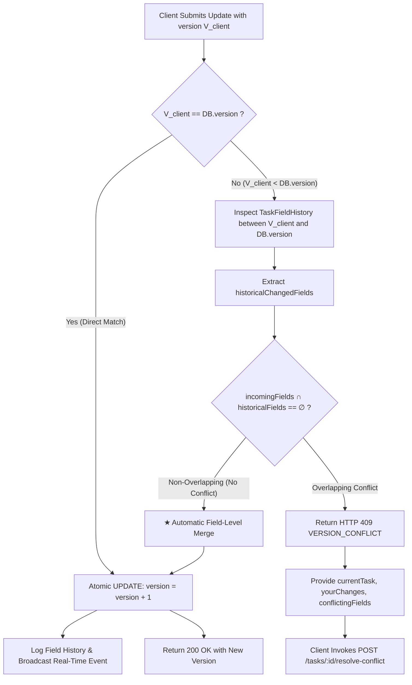
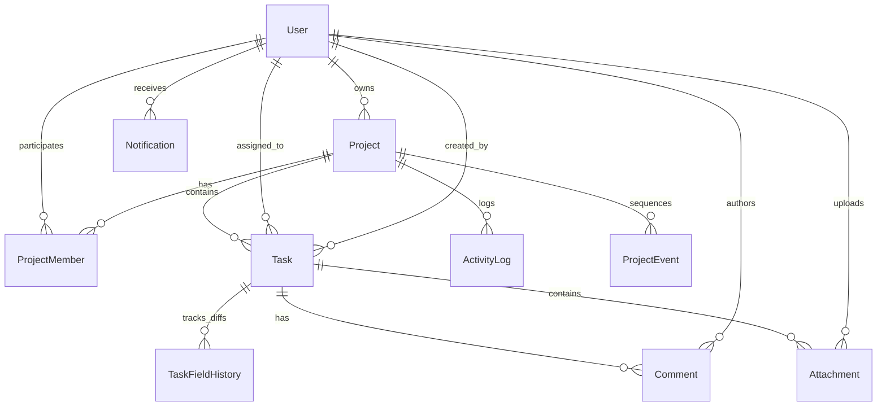

# Architecture & Design Specification: Collaborative Project Workspace

## 1. System Overview

The **Collaborative Project Workspace Backend** (PS ID: `ALG-WEB-01`) is an enterprise-grade, real-time collaboration engine designed around 4 core engineering pillars:
1. **Real-time Reliability**: Monotonic event sequencing with dual-layer replay buffer (In-Memory + PostgreSQL) ensuring zero dropped state upon reconnection.
2. **Collaboration UX Support**: Live presence, advisory task editing heartbeats, and non-blocking multi-user interactions.
3. **Data Consistency**: Atomic Optimistic Concurrency Control (OCC) with intelligent field-level 3-way auto-merging.
4. **Completeness**: Production-ready auth, RBAC permissions, file attachments, cron alert schedulers, Swagger OpenAPI 3.0 docs, and Docker orchestration.

---

## 2. ★ Innovation: Optimistic Concurrency Control (OCC) & Conflict-Safe Concurrency

### The Problem in Real-Time Collaboration
In traditional project workspaces, when two engineers (e.g. Alice and Bob) open the same task simultaneously:
- Alice edits the **title** (e.g., `"Design v2" -> "Design v3"`).
- Bob simultaneously edits the **priority** (e.g., `"medium" -> "urgent"`).
- In a naive system, the second write silently overwrites the first, losing either Alice's title or Bob's priority update without warning ("Lost Update Anomaly").

### Our Multi-Tier Concurrency Architecture



### 1. Atomic Version Bump
Every task update executes within an atomic transaction:
```sql
UPDATE tasks
SET ..., version = version + 1, updated_at = NOW()
WHERE id = $id AND version = $client_version;
```

### 2. Field-Level Automatic 3-Way Merge
If a version mismatch is detected (`V_client < V_current`), the engine inspects all intervening modifications stored in `task_field_histories`:
- If the fields modified in the current request do **not** overlap with any field modified between `V_client` and `V_current`, the update is safely merged on top of the latest database state and committed as `V_current + 1`.
- The real-time event is tagged with `autoMerged: true` so the UI knows both updates co-exist smoothly.

### 3. Conflict Detection (HTTP 409)
If both users modified the exact same field (e.g. both changed `status` or both edited `description`), the request is rejected with `HTTP 409 Conflict`:
```json
{
  "error": {
    "code": "VERSION_CONFLICT",
    "message": "Task has conflicting concurrent changes on field(s): description",
    "details": {
      "currentVersion": 4,
      "currentTask": { ... },
      "yourChanges": { "description": "Alice's draft" },
      "conflictingFields": ["description"]
    }
  }
}
```

### 4. Interactive Conflict Resolution Endpoint
Clients resolve conflicts via `POST /api/v1/tasks/:id/resolve-conflict` with 3 resolution strategies:
- `"keep_mine"`: Applies client's version on top of the latest server version.
- `"keep_theirs"`: Discards local changes and aligns with server state.
- `"manual"`: Submits custom merged field values.

### 5. Advisory Soft Task Locking (Heartbeat)
While OCC guarantees data safety on the write path, the WebSocket layer prevents accidental collision on the UI path by broadcasting `task:editing:start`, `task:editing:heartbeat`, and `task:editing:stop`. If an editor stops typing or closes their tab, the advisory lock auto-expires after 30 seconds.

---

## 3. Database Schema Overview



---

## 4. Real-Time Reconnection & Sequence Replay Buffer

To guarantee network fault tolerance (e.g. mobile reconnects, temporary Wi-Fi drops):
- Every event emitted within a project receives a strictly incrementing `seq` integer.
- The server stores the last 500 events in high-speed memory ring buffers and durable PostgreSQL storage (`project_events`).
- When a client reconnects, it sends `lastSeq`. The server replays missed events (`lastSeq + 1` to `currentSeq`). If the gap exceeds the buffer limit, the server instructs the client with `syncRequired: true` to perform a clean REST fetch.
